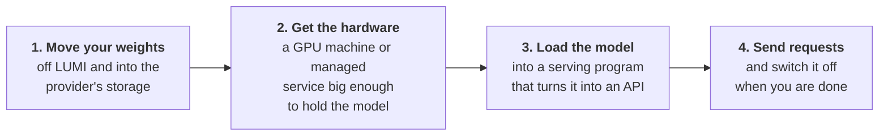

# Migrating your AI workloads from LUMI to the Cloud

> [!WARNING] Work in progress
> Finished today: this page, the AWS setup pages, and hosting on **SageMaker AI**. Moving data is written for AWS and GCP.
> Still being written: hosting on EC2, the GCP, Azure and Finnish/European hosting pages, and moving data to Azure and to a Finnish/European provider.

If you are an industry user looking to move your AI workloads (such as fine-tuned Large Language Models) from LUMI to a production-ready cloud environment, this guide provides the necessary steps.

Once you have trained or fine-tuned a model on LUMI, you will often want to **host** it somewhere it can answer requests, as an API that your application, colleagues, or users can send questions to. LUMI is designed for research and development; for hosting a running service, you move to a cloud provider.

These materials walk you through doing that on several platforms. The provider-specific pages differ in the details, but the overall journey is the same everywhere: get your model weights into the provider's storage, rent a GPU-backed machine or managed service, load the model, and call it as an API. 

This page collects the things that are **true on every platform**, so the provider pages don't have to repeat them. It is written to be followed even if you have never used a cloud provider before. Where a step involves a cloud-specific concept, there is a short plain-language explanation of what it is and why it matters. Technical readers can skim the explanations and go straight to the commands.

## The shape of the task

Regardless of provider, hosting a fine-tuned LLM comes down to four moves:

## Cost: the one thing to internalise first

GPU compute is expensive and is billed **by the hour, for every hour it is switched on**, not by how much you actually use it, just like LUMI. This is true on every cloud. A machine large enough to host a big model can cost several to well over ten euros per hour, so a machine left running over a weekend by accident is the most common way people get an unpleasant bill. Build the habit of **shutting a model down as soon as you finish using it**, and only turning it back on when you need it. Each provider page shows exactly how to switch things off for that platform.

Storage is the cost that keeps running after the GPU is switched off. It is cheap but not free, at roughly **€0.02 per GB per month** on the big providers, so a 145 GB model sitting in a bucket costs a few euros a month for as long as you leave it there. That is small next to GPU time, but it accumulates quietly across old checkpoints, duplicate uploads, and half-finished transfers. Upload only the folder you actually serve, and delete what you no longer need: unused models, earlier versions, and the datasets you only needed for training.

The safety net every account should have is a **budget alert**, a rule that emails you when the month's spend passes a figure you choose. Set one up before you start, because it is the only thing that tells you about a mistake you have not noticed yet.

## Preparing your weights (any platform)

Serving programs expect your model in the standard **Hugging Face format**: a single folder containing the configuration files, the weight files (usually several `*.safetensors` files), and the tokenizer files. Two things help on every platform:

- Keep the model in **one clean folder** with nothing else in it. If your training run left behind optimiser states, checkpoint sub-folders, or other files, copy just the model files into a fresh folder. Storage services upload everything you give them, so extra files just cost time and money.
- Leave the files **uncompressed** (don't zip or tar them). Serving stacks load an uncompressed folder directly and faster.

## How much GPU memory does my model need?

The model's weights must fit in the machine's total GPU memory, with headroom left over for the conversation itself (longer prompts and answers need more). A useful rule of thumb for a standard 16-bit (bf16/fp16) model is roughly **2 GB of GPU memory per billion parameters**, plus overhead for KV cache and more.

## Choosing a Cloud Provider

When deciding which cloud provider to use for your AI workloads, a great rule of thumb is to **stick to the cloud provider that your team is already working with or has experience with**. Whichever you pick, most of your time goes on permissions, quotas and sizing rather than on anything that distinguishes one provider from another, so an account somebody can already navigate beats a marginally better platform nobody has seen.

Two separate things stand between you and a GPU, and it is worth knowing which one you are hitting. The first is a **quota**, a per-account limit that starts at zero for GPU machines and has to be raised. You request the increase in the provider's console and small requests are usually granted within a couple of hours. That part works the same worldwide. The second is **capacity**: whether the provider physically has a free machine of that type in your region on the day you ask. This is the harder one in Europe. Providers install their newest GPUs in their largest regions first, and European regions receive fewer of them and receive them later: AWS's current generation reached the US in January 2026 and Stockholm only in July. An approved quota does not reserve a machine for you, so a launch can still fail for lack of hardware afterwards.

If you are starting fresh, consider the following nuances:

- **Amazon Web Services (AWS)**: 
  - **Pros & Cons**: The widest choice of GPU machines and hosting services, and by far the most documentation, examples, and third-party help to draw on. It is also the most complicated: overlapping services that do similar things, permissions that must be exactly right before anything works at all, and a console that assumes you already know what you are looking for. Suits a team where somebody will own the setup rather than click through it once.
  - **Capacity in EU/Finland**: AWS does not have a region inside Finland. The closest region is in Stockholm, Sweden (`eu-north-1`), which provides excellent latency to Finland. [View global infrastructure](https://aws.amazon.com/about-aws/global-infrastructure/regions_az/).
  - **Pricing**: [AWS Pricing Calculator](https://calculator.aws/)

- **Google Cloud Platform (GCP)**: 
  - **Pros & Cons**: The gentlest of the large providers to start on, with ML tooling that hangs together rather than needing assembly. Fewer knobs than AWS, which is a relief until you need one it does not expose, so it can feel restrictive if you have custom networking or infrastructure requirements. Its smaller regions carry a narrower selection of GPUs, so check what is on offer where you intend to run.
  - **Capacity in EU/Finland**: GCP has a dedicated region located in Hamina, Finland (`europe-north1`), powered by sustainable energy. [View global infrastructure](https://cloud.google.com/about/locations).
  - **Pricing**: [Google Cloud Pricing Calculator](https://cloud.google.com/products/calculator)

- **Microsoft Azure**: 
  - **Pros & Cons**: Ideal for teams deeply integrated into the Microsoft ecosystem or those requiring exclusive integrations, such as specific OpenAI models hosted directly on Azure infrastructure.
  - **Capacity in EU/Finland**: Azure does not have a region inside Finland yet. The closest region is Sweden Central. [View global infrastructure](https://azure.microsoft.com/en-us/explore/global-infrastructure/geographies/).
  - **Pricing**: [Azure Pricing Calculator](https://azure.microsoft.com/en-us/pricing/calculator/)

- **Finnish / European Providers (e.g., UpCloud)**: 
  - **Pros & Cons**: A great option for projects with strict data residency, privacy requirements, or teams that want to support the local Finnish/European economy. They often offer straightforward pricing and excellent local support.
  - **Capacity in EU/Finland**: Dedicated data centres located directly in Helsinki and other European hubs.
  - **Pricing**: [UpCloud Pricing](https://upcloud.com/pricing)
